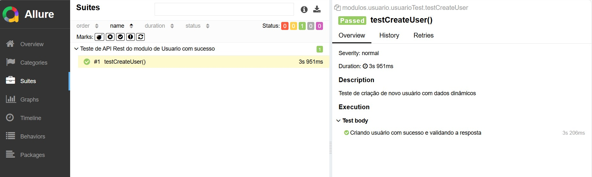

# Desafio teste de API Getnet
## Instruções do desafio:
Prática de API
Desenvolva o script da automação seguindo as informações a seguir:
- Documentação = https://reqres.in/
- URI = https://reqres.in/api/

1) Validar o script de "CREATE" método "POST” cobertura de testes em Rest-
   Assured da API

2) Validar cobertura de Status Code, Campos obrigatórios e Contrato
3) Desenvolver com POJOs.

## Tecnologias Utilizadas

- Java
- Maven
- Rest-Assured
- Allure report
- IntelliJ IDEA
- JUnit
- Faker (para geração de dados falsos em testes)

### Configuração
- [Instalação do Java JDK no Windows](https://www.youtube.com/watch?v=laC0fiI-IOM)
- [Instalação do Maven](https://www.youtube.com/watch?v=rfhTnfbBQcY)

>ATENÇÃO 
### Pré requisitos:
Antes de começar, garanta que você já tem configurado e instalado:
- Java 17
- Maven

## Uso
Instruções sobre como instalar e configurar o projeto:


1) Fazer git clone do projeto
```bash
git clone https://github.com/Daiana-Iris-Brites/getnetApi.git
cd getnetApi

```
2) Navegue até o diretório do projeto pelo terminal de sua preferência
3) Execute para instalar as dependências:
```bash
  mvn clean install

```

## Instruções sobre como utilizar o projeto

Execute os testes: mvn test
```bash
  mvn test

```

Gere o relatório do Allure: 
```bash
  mvn allure:report

```
Visualize o relatório do Allure: mvn allure:serve
```bash
  mvn allure:serve

```
Após a execução dos testes, você pode encontrar os relatórios do Allure no diretório ´target/allure-report´. Abra o arquivo index.html em um navegador para visualizar o relatório completo.

### 📈 Relatórios dos testes
Para gerar os relatórios de testes do Allure, é necessário fazer a instalação do Allure conforme a documentação oficial: https://docs.qameta.io/allure/#_installing_a_commandline


### Oportunidades de melhorias
Analisando possíveis cenários de testes, como campos em branco, e considerando que não há uma documentação específica que descreva o comportamento correto da resposta, foram adicionados cenários adicionais. Em um cenário real, essa seria uma oportunidade para colaborar com o time de desenvolvimento, discutindo possíveis melhorias e impactos no sistema conforme as entregas forem realizadas.
